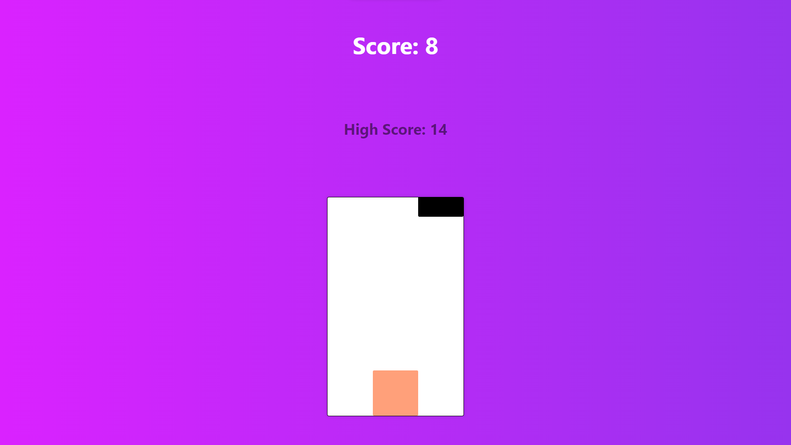

<h1 align=center>Subway Surfers Like Game</h1>

<p align=center>

</p>


📌 So this idea is inspired by a game I used to play on mobile as teenager, called `Subway Surfers`

<br>

## 😎 Watch live

[](https://beautiful-blini-e47329.netlify.app)

<br>

## 🏠 Run Locally

Clone the project

```bash
  git clone https://github.com/K1riakos/subway-surfers-2d
```

Go to the project directory

```bash
  cd netflix-landing-clone
```

<br>

## ⚙️ Used

**👉 Coding**


<br>

**🖥️ Editor**


<br>

**🛠️ Version Control**


<br>

## 🙋🏻‍♂️ Author

**Kyriakos Kiri Sidiropoulos**
